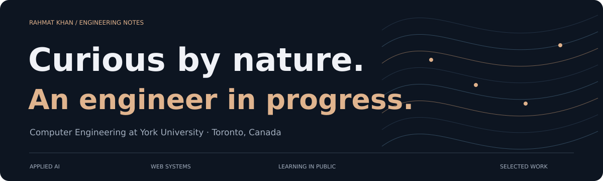
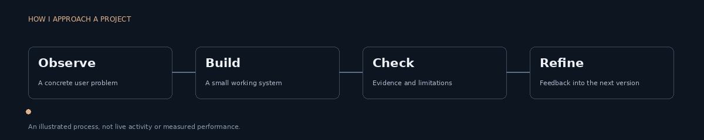
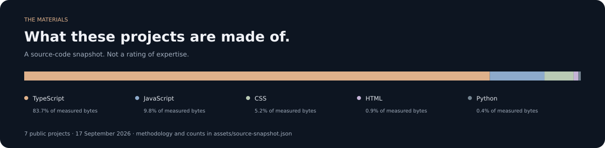

  <a href="https://github.com/rkhan28/rahmat-portfolio">Portfolio source</a> &nbsp; / &nbsp;
  <a href="https://github.com/rkhan28?tab=repositories">Repositories</a> &nbsp; / &nbsp;
  <a href="mailto:rahmatkhan2001@hotmail.com">Get in touch</a>

I’m Rahmat, a computer engineering student at York University. I’m interested in the space between useful software and applied AI: how a system observes something, makes a decision, and gives someone a result they can actually inspect.

I build to learn, document the rough edges, and improve the parts that matter. I’m exploring junior software development and automation opportunities in Canada.

---

### 01 / Currently exploring

**VolleyVision — from a frame to a match.** An interactive learning project explaining court calibration, ball tracking, shot recognition and rally analysis. Includes a playable court illustration, eight explorable chapters, a detailed technical curriculum, and a Python reporting exercise.

The tutorial is implemented; the actual vision pipeline is a documented roadmap. No trained-model results are claimed.

[Open the interactive deployment (Vercel sign-in currently required) ↗](https://volleyvision-rkhan-s-projects.vercel.app)

[Explore the repository ↗](https://github.com/rkhan28/volleyanalsysis) &nbsp; · &nbsp; [Read the curriculum ↗](https://github.com/rkhan28/volleyanalsysis/blob/main/docs/CURRICULUM.md)

### 02 / Selected projects

| Project | The problem I explored | What you can inspect |
| :--- | :--- | :--- |
| **[TTC Pulse ↗](https://github.com/rkhan28/ttcpulse)** | Making Toronto transit information easier to navigate | Feed integration, maps, service alerts, and an optional assistant; live-data limitations documented |
| **[FinanceTracker ↗](https://github.com/rkhan28/FinanceTracker)** | Keeping everyday student spending understandable | Manual transactions, budgeting charts and browser-local persistence |
| **[Netflix IMDb Filter ↗](https://github.com/rkhan28/netflixfilter)** | Narrowing visible titles while browsing | Chrome extension, OMDb lookups and user-configured filters |
| **[PhishGuard ↗](https://github.com/rkhan28/phishguard)** | Making suspicious-message review more approachable | Sample reports and a deterministic keyword demo; no trained phishing model |

### 03 / How I work

<strong>Open the engineering notes</strong>

- **Start with a question.** What would make this useful to the person using it?
- **Make the smallest complete path work.** Input, processing, output and a way to recover from failure.
- **Separate demos from evidence.** Sample data is labelled; a planned feature is not described as shipped.
- **Keep the project readable.** Setup instructions, meaningful commits, build checks and explicit limitations.

The animation illustrates this process. It does not represent live activity, contribution counts or measured performance.

### 04 / The materials

<strong>How this chart was calculated</strong>

A dated snapshot of source-file bytes across seven public app projects. It excludes dependency directories, generated build output, backend folders and lockfiles. TypeScript includes TSX; JavaScript includes JSX. It is a working-tree snapshot, not GitHub Linguist, and is not automatically refreshed.

[View the exact counts and repository breakdown](assets/source-snapshot.json).

---

**Interested in the work, or have a useful critique?** [Let’s talk.](mailto:rahmatkhan2001@hotmail.com)

Toronto, Canada · Learning in public · Clear claims, inspectable work.
